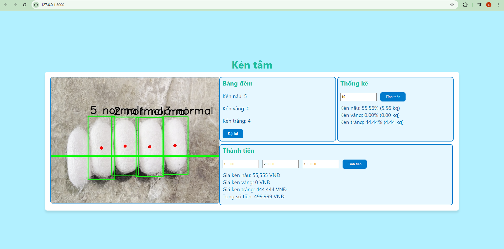

<h2>Display</h2>

<h3>This is the system interface</h3>



<h3>Reason</h3>

View the machine's operational progress.

Statistics on the percentage of each of the three types of cocoons.

Statistics on the weight of each type and how much of the total cocoon weight they occupy.

Calculate the amount of money for each type of cocoon.

Calculate the total amount of money for all three types.

<h2>HOW TO RUN</h2>

```python back_end.py```